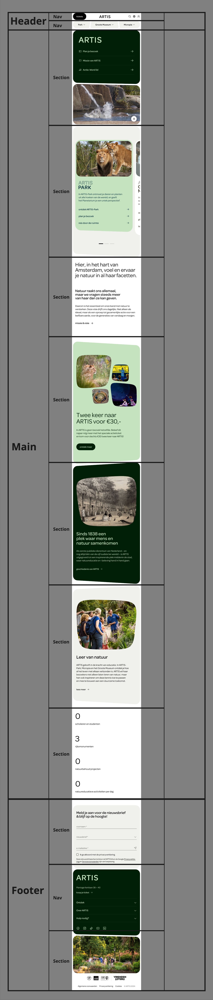
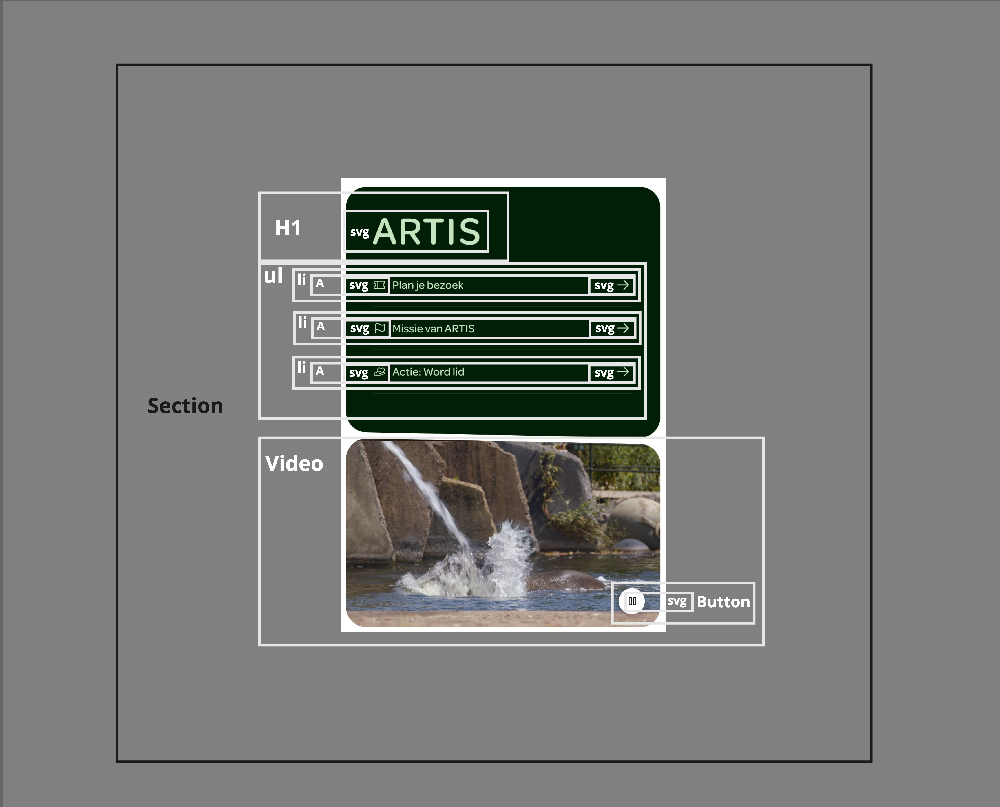

# Procesverslag
Markdown is een simpele manier om HTML te schrijven.  
Markdown cheat cheet: [Hulp bij het schrijven van Markdown](https://github.com/adam-p/markdown-here/wiki/Markdown-Cheatsheet).

Nb. De standaardstructuur en de spartaanse opmaak van de README.md zijn helemaal prima. Het gaat om de inhoud van je procesverslag. Besteedt de tijd voor pracht en praal aan je website.

Nb. Door *open* toe te voegen aan een *details* element kun je deze standaard open zetten. Fijn om dat steeds voor de relevante stuk(ken) te doen.

## Jij

  
uitwerken voor kick-off werkgroep

  ### Auteur:
  Quincy Kapenga

  #### Je startniveau:
  Rood

  #### Je focus:
  Helemaal responsive
 

## Je website

  
uitwerken voor kick-off werkgroep

  ### Je opdracht:
  https://www.artis.nl/nl / de Site van Artis
  #### Screenshot(s) van de eerste pagina (small screen): 
  Home
  

  #### Screenshot(s) van de tweede pagina (small screen):
  Dieren   
  
 

## Toegankelijkheidstest 1/2 (week 1)

  
uitwerken na test in 2e werkgroep

  ### Bevindingen
  Lijst met je bevindingen die in de test naar voren kwamen:
  - Artis heeft een extra navigatie die niet te zien is als je geen screenreader gebruikt, hierin kun je in 1 keer naar zoeken, de content of de footer van de pagina.
  - Het is wel lastig navigeren door de pagina, omdat er altijd een verborgen cookies menu is waar je doorheen moet.
  - 
 

## Breakdownschets (week 1)

  
uitwerken na afloop 3e werkgroep

  ### de hele pagina: 
  

  ### dynamisch deel (bijv menu): 
  

  ### wellicht nog een dynamisch deel (bijv filter): 
  

## Voortgang 1 (week 2)

  
uitwerken voor 1e voortgang

  ### Stand van zaken
  hier dit ging goed & dit was lastig (neem ook screenshots op van delen van je website en code)

  ### Agenda voor meeting
  samen met je groepje opstellen

  | Ocean      | Quincy         | student 3    | student 4        |
  | ---        | ---            | ---          | ---              |
  | Navbar     | Navbar         | en ik dit    | en dan ik dat    |
  | en dat ook | Carousel       | nog een punt | dit wil ik zeker |
  | ...        | sections.      | ...          | ...              |

  ### Verslag van meeting
  hier na afloop snel de uitkomsten van de meeting vastleggen

Hier is de feedback in eenvoudigere taal:  

- Eerste blokje 
  - Gebruik een section element met twee article elementen erin.  
  - Pas met CSS de richting van de elementen aan (bijvoorbeeld via flexbox) zodat het goed werkt op verschillende schermgroottes.  

- Alt-teksten:  
  - Schrijf duidelijke alt-teksten voor je afbeeldingen.  
  - Dit helpt mensen die een screenreader gebruiken om te begrijpen wat er op je site staat.  

- Netjes coderen:  
  - Let op dat je code netjes is ingesprongen. Dit maakt het makkelijker te lezen en te begrijpen.  

- Carousel:  
  - Maak je carousel met scroll-snapping en flexbox.  
  - Zoek op CodePen naar voorbeelden als je vastloopt.  

- Data-element:  
  - Gebruik het data element als je bepaalde gegevens in je site wilt toevoegen.  
  - Kijk op MDN Web Docs voor uitleg.  

- Footer formulier:  
  - Voor het formulier in de footer kun je een form element gebruiken.  

- Header:  
  - Gebruik een details element voor uitklapbare menu’s of andere interactieve dingen.  
  - Houd er rekening mee dat het lastig kan zijn om dit netjes te stijlen.  

- Handige bronnen:  
  - Kijk op MDN Web Docs en CodePen voor meer uitleg en voorbeelden.  

## Voortgang 2 (week 3)

  
uitwerken voor 2e voortgang

  ### Stand van zaken
  hier dit ging goed & dit was lastig (neem ook screenshots op van delen van je website en code)

  ### Agenda voor meeting
  samen met je groepje opstellen

  | Ocean          | Quincy             | student 3    | student 4        |
  | ---            | ---                | ---          | ---              |
  | Responsive.    | Css.               | en ik dit    | en dan ik dat    |
  | positionering  |                    | nog een punt | dit wil ik zeker |
  | ...            | ...                | ...          | ...              |

  ### Verslag van meeting
  hier na afloop snel de uitkomsten van de meeting vastleggen

  - @media (preders-reduced-motion:no-prefrence) voor toegankelijkheid
  - Css clippy voor de randen

## Toegankelijkheidstest 2/2 (week 4)

  
uitwerken na test in 9e werkgroep

  ### Bevindingen
  Lijst met je bevindingen die in de test naar voren kwamen (geef ook aan wat er verbeterd is):

## Voortgang 3 (week 4)

  
uitwerken voor 3e voortgang

  ### Stand van zaken
  hier dit ging goed & dit was lastig (neem ook screenshots op van delen van je website en code)

  ### Agenda voor meeting
  samen met je groepje opstellen

  | student 1      | student 2          | student 3    | student 4        |
  | ---            | ---                | ---          | ---              |
  | dit bespreken  | en dit             | en ik dit    | en dan ik dat    |
  | en dat ook nog | dit als er tijd is | nog een punt | dit wil ik zeker |
  | ...            | ...                | ...          | ...              |

  ### Verslag van meeting
  hier na afloop snel de uitkomsten van de meeting vastleggen

  - punt 1
  - punt 2
  - nog een punt
  - ...

## Eindgesprek (week 5)

  
uitwerken voor eindgesprek

  ### Je uitkomst - karakteristiek screenshots:
  

  ### Dit ging goed/Heb ik geleerd: 
  Korte omschrijving met plaatjes

  

  ### Dit was lastig/Is niet gelukt:
  Korte omschrijving met plaatjes

  

## Bronnenlijst

  
continu bijhouden terwijl je werkt

  Nb. Wees specifiek ('css-tricks' als bron is bijv. niet specifiek genoeg). 
  Nb. ChatGpT en andere AI horen er ook bij.
  Nb. Vermeld de bronnen ook in je code.

  1. bron 1
  2. bron 2
  3. ...

